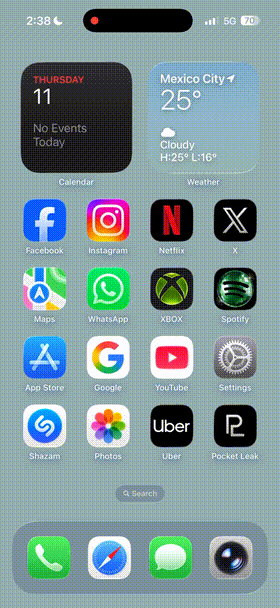

# Pocket Leak

Pocket Leak is a local-first iPhone micro-expense tracker for fast capture, clear spending signals, widgets, goals, category budgets, recurring expenses, and polished portfolio demos.

It is designed for people who want to understand small daily spending without connecting bank accounts, creating an account, or sending data to the cloud.

## Demo

Pocket Leak runs locally on iPhone and focuses on fast manual capture, privacy-friendly tracking, visual spending summaries, goals, budgets, recurring expenses, and home screen widgets.

<p align="center">
  
</p>

<p align="center">
  <a href="docs/assets/readme/demo-video.mov">Watch the full demo video</a>
</p>

## The Problem

Tiny purchases are easy to forget and hard to summarize later. Coffee, snacks, rides, subscriptions, and convenience-store stops add up quietly. Pocket Leak reduces capture friction so those expenses can be logged quickly and reviewed later with useful local summaries.

## Core Features

* Quick Add for amount, category, merchant, and note
* Manual parser for pasted or shared transaction text
* Dashboard with totals, category distribution, trend bars, signals, and recent activity
* History with filters, sorting, and export-friendly browsing
* Goals for weekly and monthly spending limits
* Category budgets for Coffee, Food, Transport, Shopping, and more
* Recurring expenses for upcoming fixed charges
* Insights for averages, comparisons, and spend patterns
* Widget support for glanceable local summaries
* Share Extension for explicit text handoff
* Local backup, CSV export, JSON export, and PDF export
* Demo Mode for synthetic screenshot and video data
* Stress testing workflows for large local datasets

## Demo Flow

1. Open Settings.
2. Load Demo Data from the Demo Mode section.
3. Return to Dashboard and show spending summaries, goals, budgets, and recurring items.
4. Open History and scroll through the synthetic data set.
5. Open Goals and Insights to show progress and category patterns.
6. Reset Demo Data or Clear All Data when you are done.

## Tech Stack

* Swift
* SwiftUI
* WidgetKit
* UserNotifications
* Foundation parsing and formatting helpers
* Core Graphics and UIKit-based PDF export
* XcodeGen project generation
* Local JSON persistence

## Architecture

* `ViewModels/ExpenseViewModel.swift` owns the app state and local summaries
* `Services/` contains persistence, demo generation, export, backup, formatters, and notification helpers
* `Views/` contains the main SwiftUI screens
* `Widgets/` contains the widget target
* `ShareExtension/` contains explicit shared-text intake
* `Theme/` contains visual tokens, app settings, and localization strings
* `Models/` contains expenses, goals, budgets, recurring expenses, filters, and widget summaries

The app uses reusable summary helpers so Dashboard, History, Goals, Insights, and widgets avoid unnecessary heavy work during rendering.

## Privacy

Pocket Leak is intentionally local-first.

* Expenses stay on device
* No login is required
* No cloud sync is used
* No analytics SDK is required for core use
* No bank scraping is performed
* Manual parsing only runs on text the user pastes or shares intentionally
* Widgets show local summaries only
* Share Extension intake is explicit only

## iOS Limitations

* Pocket Leak cannot read other apps' notifications automatically
* Back Tap must be wired through a user-created Shortcut
* Share Extension intake is explicit only
* Widgets can show summaries, not hidden account data
* Free installation on a physical iPhone still requires a Mac with Xcode
* TestFlight and App Store distribution require the Apple Developer Program

## Run Locally

1. Install Xcode.
2. Install XcodeGen.
3. Clone this repository.
4. Generate the Xcode project.
5. Open `JTap.xcodeproj`.
6. Build and run the shared `JTap` scheme.

```bash
xcodegen generate
open JTap.xcodeproj
```

## Running Locally For Free

GitHub can share the source code, but it cannot provide a one-tap iPhone installation like the App Store.

For now, Pocket Leak is meant to be:

* run locally from Xcode
* installed on a personal iPhone through Xcode
* used as a SwiftUI/iOS portfolio project
* extended through future local-first phases

## XcodeGen Setup

The generated Xcode project is checked in, but the source of truth is the XcodeGen configuration in the repo.

```bash
xcodegen generate
```

After regenerating, open `JTap.xcodeproj` and build the `JTap` scheme in Xcode.

## Suggested Build Commands

```bash
xcodegen generate

xcodebuild -project JTap.xcodeproj -scheme JTap -destination 'generic/platform=iOS' -derivedDataPath /private/tmp/JTapDerivedData CODE_SIGNING_ALLOWED=NO build

xcodebuild -project JTap.xcodeproj -scheme JTap -configuration Release -destination 'generic/platform=iOS' -derivedDataPath /private/tmp/JTapReleaseDerivedData CODE_SIGNING_ALLOWED=NO build
```

## Roadmap

Current focus:

* local stability
* stress testing
* demo data
* GitHub portfolio polish
* free local installation documentation

Future work:

* stronger stress testing for 1-2 months of daily expense data
* local performance cleanup
* portfolio case study
* free local install guide
* cloud sync planning
* account login planning
* multi-device support
* friend circles
* privacy-safe leaderboards
* challenges

## Project Status

Pocket Leak is a polished local-first portfolio build, not a published App Store release.

Current strengths:

* strong SwiftUI foundation
* local persistence
* widget and share extension support
* demo mode for screenshots and video
* stress testing direction for large local datasets
* privacy-friendly architecture
* no dependency on bank scraping or cloud services

## Disclaimer

Pocket Leak does not scrape bank data, does not read other apps' notifications, and does not depend on cloud services. The product is intentionally local-first and explicit about any text the user chooses to paste or share.
